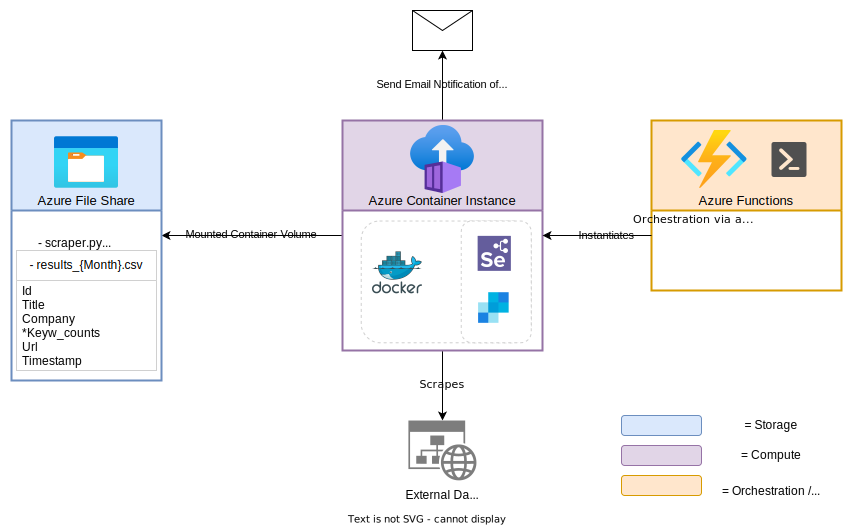

# About

A Webscraper for freelance.de in Python using the Selenium and Sendgrid packages. Intended to be run on a serverless Azure architecture consisting  of an Azure Container Instance for Computation / Extraction & Transformation & Notification and an Azure Function in Powershell for Orchestration/ Infrastacture-as-Code. The scraper simply opens freelance.de, logs in, executes a search for the predefined search terms, parses & appends the new results (which can span multiple pages) and lastly sends an email of the new relevant job if appropriate.

Execution 8 times a day from Monday till Friday is less than 5€/month, only possible due to the serverless nature. Of that, 70% are storage costs.

---

## Architecture

1. A cronjob triggerred Azure Function orchestrates the whole ordeal, acting as Infrastracture-as-Code by starting the Container Instance via Powershell
2. The container is created with a mounted Fileshare to enable persistence of data
3. The Container Instance scrapes freelance.de in aforementioned manner, appending the new jobs to `results_{Month}.csv` and updating the watermark.
4. If applicable, an email with a set of newly found relevant jobs gets sent to the recipient using sendgrid API.
5. The Function stops the container instance

---

## How to deploy

### Prerequisites
- Powershell with the Azure module installed is needed to perform the rbac
- An Azure File Share
- An Azure Function App with a Powershell Function
- A freelance.de Premium account

### Function App Deployment

1. Configure `assign-rbac.ps1`, `profile.ps1` and `run.ps1` (meaning enter your personalized data)
2. Run `assign-rbac.ps1`
3. Replace the contents of `requirements.psd1`, `profile.ps1` as well as `run.ps1` of your Azure Function with the files from this function folder
4. Done!

### Script & Storage Configuration
1. Configure `config.json` (meaning enter your personalized data)
2. Upload `scraper.py` and `config.json` to the File Share
3. Done!

That's it! The container instance uses a Dockerhub image based on the dockerfile in this directory and it should automatically access `scraper.py` and `config.py` from your File Share. The function can be of any kind, not only time triggerred.

---

### Relevancy Evaluation

The parsing basically consists of a relevancy evaluation at one's will so that a subset of highly appropriate new results (job postings) are subsequently sent via email to the recipient. 
Whether a new job gets send via email depends on the relevancy condition. Right now it is simply a function of search word occurence counts - but that works satisfactory: Word1 and Word2 must occur in the job description; word3 and word4's occurrences must add up to at least 3.

### To Do:
- [x] Email specific error if Container fails during runtime
- [ ] 1-click Setup (e.g. Terraform)